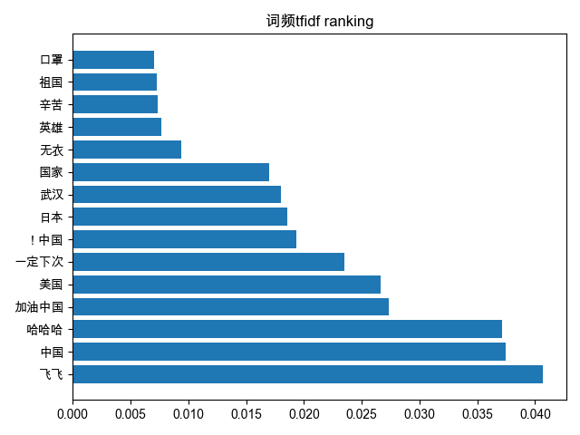
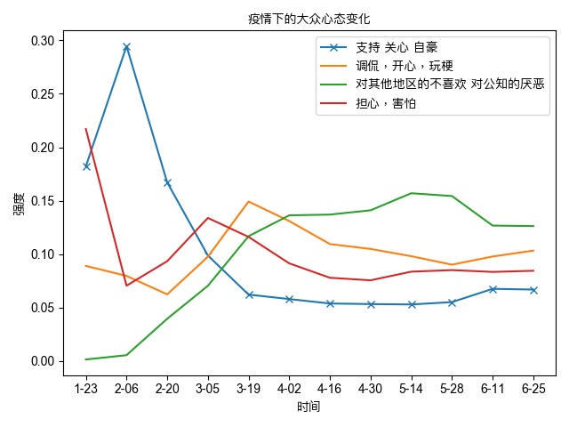
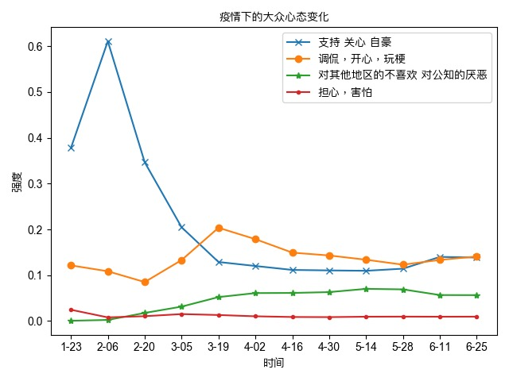
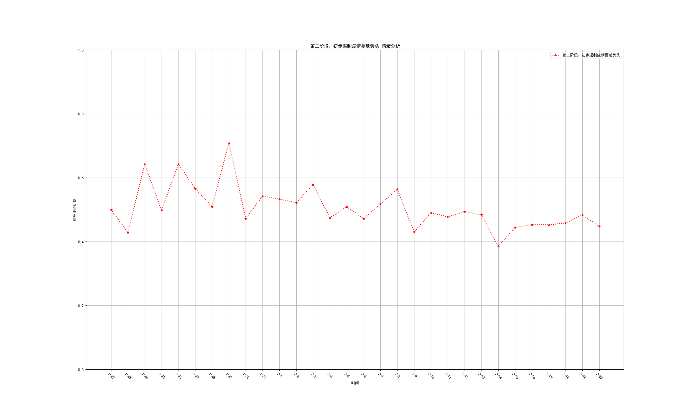
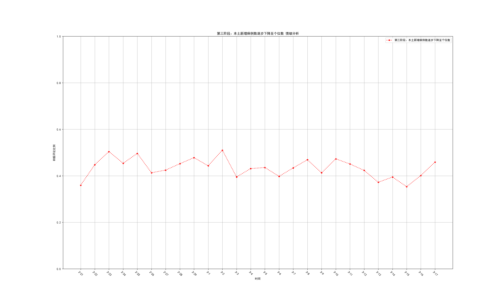
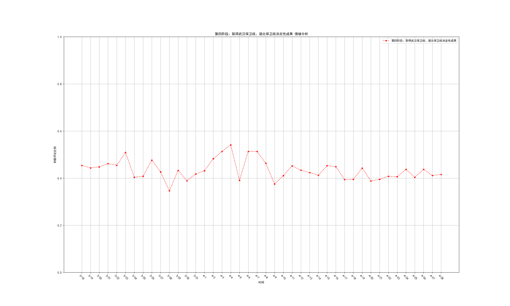
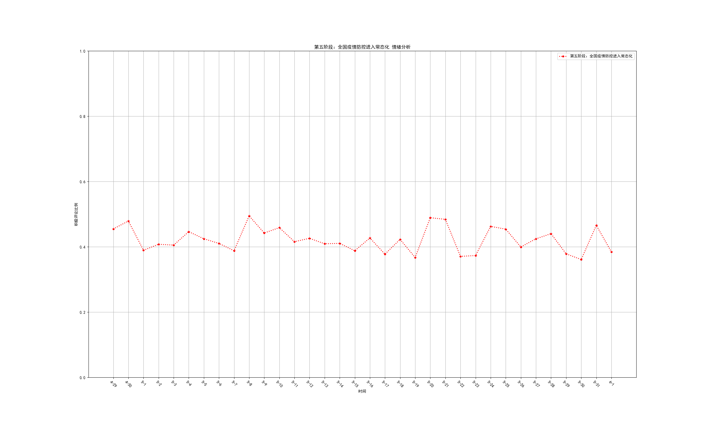
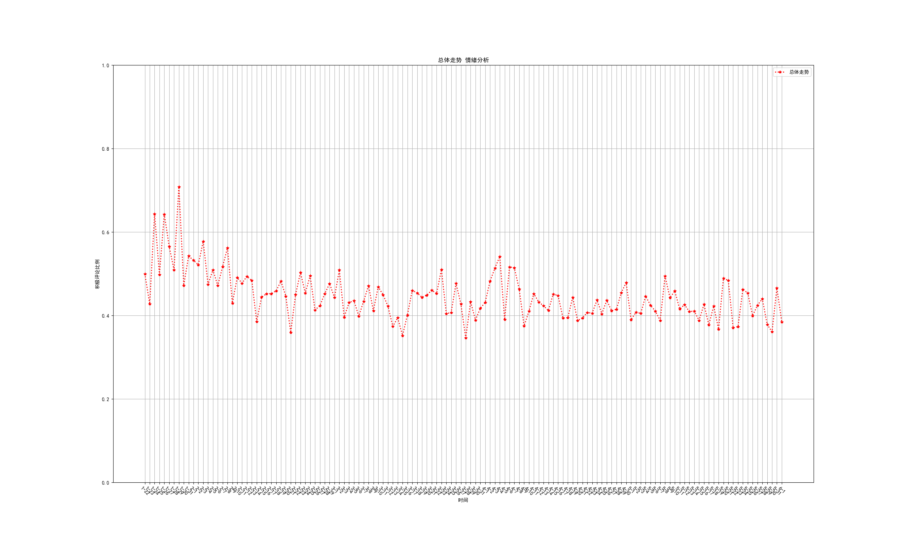
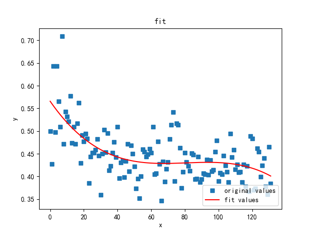

# 新冠疫情下民众的心态和情绪分析

数据科学大作业研究报告。

基本信息：

- 组长：潘昱光，学号；
- 组员：袁军平，学号、侯为栋，学号191250045；
- 开源项目地址：https://github.com/xxh160/data_sci。

## 引言
（提出问题）

## 项目整体架构

数据科学大作业后端。

```
├── README.md
├── app
│   ├── __init__.py
│   ├── analyzer
│   │   ├── __init__.py
│   │   ├── mindset.py
│   │   ├── visible
│   │   │   ├── TFIDFview.py
│   │   │   └── mindchange.py
│   │   ├── word_cloud
│   │   │   ├── __init__.py
│   │   │   └── ciyun.py
│   │   └── word_frequency
│   │       ├── Mindset.py
│   │       ├── TFIDF.py
│   │       ├── __init__.py
│   │       ├── analysis.py
│   │       ├── bilibiliGP.py
│   │       └── date.py
│   ├── sentiment_classifier
│   │   ├── __init__.py
│   │   ├── lan_lib
│   │   │   ├── neg
│   │   │   │   └── 2.txt
│   │   │   └── pos
│   │   │       └── 1.txt
│   │   ├── outer
│   │   │   ├── neg
│   │   │   │   ├── neg.0.txt
|   |   |   |   ├── ...
│   │   │   └── pos
│   │   │       ├── pos.0.txt
│   │   │       ├── ...
│   │   ├── predicate.py
│   │   ├── pyhanlp_predication
│   │   │   ├── __init__.py
│   │   │   ├── model.ser
│   │   │   └── predict.py
│   │   ├── snownlp_predication
│   │   │   ├── __init__.py
│   │   │   └── predict.py
│   │   └── store
│   │       ├── bilibili
│   │       │   ├── bilibili_总体走势.csv
│   │       │   ├── ...
│   │       │   └── img
│   │       │       ├── bilibili_总体走势.png
│   │       │       ├── ...
│   │       └── weibo
│   │           ├── img
│   │           │   ├── weibo_总体走势.png
│   │           │   ├── ...
│   │           ├── weibo_总体走势.csv
│   │           ├── ...
│   ├── preprocessor
│   │   ├── __init__.py
│   │   ├── preprocess.py
│   │   └── store
│   │       ├── bilibili
│   │       │   ├── bilibili_2020-01-26.csv
│   │       │   └── ...
│   │       ├── south
│   │       │   ├── south_2020-03-25.csv
│   │       │   ├── ...
│   │       └── weibo
│   │           ├── weibo_2020-01-24.csv
│   │           ├── ...
│   ├── scraper
│   │   ├── __init__.py
│   │   ├── bilibili.py
│   │   ├── people.py
│   │   ├── raw
│   │   │   ├── 1传33！大连本轮疫情出现超级传播.csv
│   │   │   ├── ...
│   │   ├── scrape.py
│   │   ├── south.py
│   │   ├── store
│   │   │   ├── bilibili
│   │   │   │   ├── bilibili_2020-01-29.csv
│   │   │   │   ├── ...
│   │   │   ├── south
│   │   │   │   ├── south_2019-12-31.csv
|   |   |   |   ├── ...
│   │   │   └── weibo
│   │   │       ├── weibo_2019-12-31.csv
│   │   │       ├── ...
│   │   └── weibo.py
│   └── util
│       ├── __init__.py
│       ├── csv_util.py
│       ├── news_util.py
│       ├── str_util.py
│       └── yaml_util.py
├── config.py
├── doc
│   ├── analyzer.md
│   ├── minutes
│   │   └── 2020-1-20.md
│   ├── sentiment_classifier.md
│   ├── preprocessor.md
│   └── scraper.md
├── manage.py
├── resource
│   ├── __init__.py
│   └── log_config.yml
└── test
    └── __init__.py
```

项目整体为`Flask`应用程序框架，方便做前后端扩展，但受限于事件，前端我们只搭了一个架子，没有正式开始前后端交互工作。

`app`包下共有4个子模块，分别是：

- `scraper`：爬虫模块；
- `preprocessor`：数据预处理模块；
- `analyszer`：心态分析模块；
- `sentiment_classifier`：情绪预测模块。

## 数据获取

一开始，我们确立了四个目标：微博、B站、人民日报和南方网。

微博和B站作为民间媒体平台，其评论是我们所着重考虑的数据资源；而人民日报和南方网相对来说偏官方，同时也没有评论获取渠道，于是我们对后者的爬取主要集中于其正文内容。

四个爬虫在代码中分别对应：

- `weibo.py`；
- `bilibili.py`；
- `south.py`；
- `people.py`。

每个数据源都呈现出不同的特点。微博信息多而杂，代码凌乱不易阅读，如果有大规模有序获取信息的需求则必须使用`selenium`类库；B站没有高级搜索接口，难以在初期筛选中寻找到最符合条件的信息，从而带来后期工作量的巨大；人民日报只能通过日期筛选；南方网和微博的情况类似，但是数据质量更差、量更少。

考虑到本次作业的数据集需要体现大众的整体心态，我们选择了更加具有代表性的微博和B站的数据分别进行分析。人民日报的挑选效率过低，南方网可以看作是微博的下位替代品。

在我们获取的数据中，微博和B站分别具有如下特征：

- 微博：话题较多，评论集中现象较少，但爬取困难，整体规模较小；
- B站：弹幕往往集中于少数几个视频，话题集中，文本量虽大但是不具有广泛的代表性。

考虑到机器学习需要覆盖面较广的样本支持，故在情绪分析模块中将微博数据作为核心数据使用；而心态词典的建立对数据量的需求较大，故在心态分析模块将B站数据作为核心数据使用。

## 数据预处理

## 研究方法

本部分将结合具体案例进行详细讲解。

### 心态分析

心态分析的基本思路是，b站爬取的原始疫情相关弹幕数据集经过预处理后，作为实验数据集。对实验数据集的近一百个视频 200万条弹幕进行TF-IDF高频词计算

实验数据集csv文件格式为：弹幕时间 ：弹幕内容

考虑到分析过程中我们需要对每天的弹幕进行分析，我们构建了date（）函数将弹幕按照时间分类,生成的文件为txt文件，标题为日期，内容为当天的弹幕 日期为2020年1月23日至2020年6月30日

~~~python
#将弹幕按照时间分类
def date():
    r='20[0-9][0-9]-[0-9][0-9]-[0-9][0-9]'
    startday=datetime.date(2019,12,8)
    endday=datetime.date(2020,6,30)
    dic=dict()
    basepath = '/Users/yuanjunping/PycharmProjects/datascience/bilibili'
    for i in os.listdir(basepath):
        if i == '.DS_Store':
            continue
        csvpath = basepath + '/' + i
        print(csvpath)
        datas = pd.read_csv(csvpath)
        for j in datas.values:
            if(re.match(r,j[0])==False):
                continue
            d=[int(i) for i in str(j[0]).split('-')]
            CommentDate=datetime.date(d[0],d[1],d[2])
            if(CommentDate.__le__(startday) or CommentDate.__ge__(endday)):
                continue
            if(dic.keys().__contains__(j[0])==False):
                dic[j[0]] = []
            k=dic[j[0]]
            dic[j[0]].append(j[1])
    targetpath='/Users/yuanjunping/PycharmProjects/datascience/bilibilidate'
    for i in dic:
            f=open(targetpath+'/'+str(i),'w')
            for j in dic[i]:
                f.write(str(j)+'\n')
            f.close()
~~~

随后我们计算了每篇文章中各个词语出现的频率，方便计算词语的TF-IDF值,在TF-IDF.py文件中,我们构建了GetCP函数，通过jieba分词已经counter计数器对每个视频下的弹幕进行分词并统计词频，将每个视频词频前100的词已经对应评率存于videocp目录下的各个csv文件中，TFIDF函数读取以上文件，计算每个词语出现的频率以及出现的文章数,考虑到我们的样本数据量足够大，我们剔除了词频小于30的词语。最终得到共计1764个词语→tfidf的映射关系存于tfidf.csv文件中，我们选取了其中前15个最重要的词语做出如下图片：



我们对tfidf.csv文件中的词语进行情绪词筛选，最终构建心态词典如下：

~~~python
# 对国家的关心 支持 自豪 以及希望 祝愿等等
class mset:
    list1=[
        '武汉','中国','加油','无衣','与子','同袍','祖国','辛苦','英雄','无悔'
           ,'支持','骄傲','华夏','伟大','种花','感动','援助','感谢','致敬','泪目','复兴','砥砺',
        '前行','中华民族','此生' '自豪','崛起','初心','哭','国土无双' ,'钟老'  ,'国家'    ]

    # 调侃 开心 玩梗 等等
    list2=[
        '飞飞','哈哈','一定','下次','战忽局','泪目','公屏','保护','狗头',''
    '   可爱','内味', '爽哥','汪汪','口区' ,'哈哈'
    ]
    #对大陆以外地区的嘲讽，不喜欢，对国内一些人的厌恶，等等
    list3=[
            '制度','反华','罪犯','难民','道歉','日军','强盗','警察','抗日','选票','谎言','造谣','米国','妖婆','总统'
           ,'风景线','公知','讥笑','美帝','方方','敌人','BBC','建国','川普','美国','澳大利亚','日本','西方','红领巾','法国','德国','欧洲',
           '台湾','墙头草','阴阳人','政治','欧盟','自由','民主','言论','英国','政客','二战','殖民','道歉','阴阳怪气'
           ]
    #对疫情的担心 忧虑，恐惧等等
    list4=[
        '病毒','疫情','疫苗','玩忽职守','警惕','空气','新冠','危险','口罩','封城','老人','确诊',''
        '经济','罪犯','战役','隔离','恐惧' ,'流感','恐怖','末日','突变','失业',
    ]
    def getmset(self):
        return [self.list1,self.list2,self.list3,self.list4]
~~~

对于疫情中大众心态变化的计算，我们选择了以下方法：

十四天为一个单位量,将该时间段内的弹幕分词,计算四类心情词语出现的频率，函数为anaylys.py里的analys()

我们从两个角度分析结果

 1.对各种心态加权，令各种心态平均强度相同，观察各种心态随时间的变化

2. 不加权，让各种心态显示其频率的绝对值，纵向对比各种心态的强度

#### 加权后(乘系数令各种心态平均强度相同)画出心情曲线图如下：



对上图进行分析得出以下结论：

	##### 1.  对于国家的支持以及医护人员的关心心态随时间的变化

​	在疫情刚出现时,大众对于国家的支持之语，对医护人员的关心，等等心态不断上升，在二月中旬达到峰值，之后疫情逐渐稳定，这种心态强度逐渐下降,稳定在一个值

##### 2.b站网友调侃开心玩梗的心态的随时间的变化

​	我们可以看到，在疫情初期，由于对疫情的关心等，网友调侃玩梗的心态强度逐渐下降，在疫情稳定后逐渐回升，最终稳定在一个值。

##### 3.大众对于其他国家的讨论，以及对于公知等的厌恶等等心态的随时间的变化

​	疫情初期，大众多关注于祖国的疫情状况，随后疫情在国外爆发，国内疫情稳定，大众讨论国外疫情，对国外的一些情况的厌恶以及不喜欢强度逐渐上升，以及对于国内疫情爆发时一些公知的言论的厌恶程度上升，最终稳定。

##### 4.大众担忧害怕的心态随时间的变化

​	可以看到在疫情初期，大众害怕的心态强度为峰值，后整体呈下降趋势，逐渐稳定。

##### 5.四种心态都最终稳定的原因：

​	我们认为是由于随着疫情状况的稳定,大众对于疫情相关资讯的情绪状况逐渐稳定，对于疫情中的各种状况有了很高的心理承受能力，心态波动变化比较小。

#### 不加权，各种心态的绝对强度图如下：

​	

对上图分析得出结论：

##### 1.大众各种心态强度对比

可以看出，b站网友总体比较乐观，在疫情初期，对国家防疫的支持心态占据大众心态的绝对优势，随着时间推移，b站网友喜欢的玩梗以及调侃等等心态占据了优势，我们认为这是疫情常态化的结果，在疫情相关的视频下，网友们也回归常态。值得注意的是，担心，害怕这种情绪的绝对强度始终处于一个较低水平，这也说明了大众对于国家一定能够战胜疫情的信心，以及对国家防疫政策的支持。

#### 高频词词云生成：

我们去除了百度停词表中的停词,对所有弹幕生成了一个词云，以及对疫情最严重的时期的一月以及二月这个阶段生成了一个词云

词云生成代码如下：

~~~		python
# encoding: utf-8
def bilibiliall():
    stopwords=open('/Users/yuanjunping/PycharmProjects/datascience/百度停词表.txt').readlines()
    stopwords=set(stopwords)
    bilibiliallpath='/Users/yuanjunping/PycharmProjects/datascience/results/bilibiliAll.txt'
    mask = np.array(image.open('/Users/yuanjunping/PycharmProjects/datascience/mask.jpg'))
    w=wordcloud.WordCloud(font_path='/System/Library/Fonts/PingFang.ttc',max_font_size=40,mask=mask
                       ,stopwords=stopwords,
                       max_words=100   )
    s=open(bilibiliallpath).read()
    s=s.decode('utf-8')
    w.generate(s)
    w.to_file("b站词云.png")

~~~

疫情最严重时期词云结果图：


所有弹幕词云结果图：


可以看出无论是在疫情最严重时，还是总体情况，大众说的最多的就是中国加油,武汉加油一类的词语，真切的表现了大家对于国家的关心。此外，b站网友特有的下次一定让人莞尔，保护，泪目一类的词语也是弹幕的一大特色。

### 情绪预测

情绪分析的基本思路是，人工给评论打标签形成训练集，结合第三方类库提供的接口训练出具有分类功能的模型，并凭借此模型对给定数据集做出情绪强度的预测。

根据《抗击新冠肺炎疫情的中国行动》白皮书对疫情进行阶段划分。如书中所言，大致可分为如下5个阶段：

- 第一阶段：迅即应对突发疫情，2019-12-31至2020-1-19；
- 第二阶段：初步遏制疫情蔓延势头，2020-1-20至2020-2-20；
- 第三阶段：本土新增病例数逐步下降至个位数，2020-2-21至2020-3-17；
- 第四阶段：取得武汉保卫战、湖北保卫战决定性成果，2020-3-18至2020-4-28；
- 第五阶段：全国疫情防控进入常态化，2020-4-29至今。

在白皮书撰写时，`至今`可指代为2020年6月分。因此本着有效数据占比最大化的原则，我们的代码爬取的数据大多是到2020年6月份为止。

同时需要构建标签集合。一开始我们考虑使用8种情绪的分类集，但是在打标签的过程中逐渐发现各种情绪的区分度不是很大，没有必要进行如此详细的划分，于是将8种情绪压缩为两类，即`pos`和`neg`。最开始训练集的数据几乎完全来自微博爬取的数据，平均每种情绪400条左右。在后续的训练中发现始终无法达到较高的准确率，于是又加入了部分B站的数据，使得每种情绪的训练集达到了平均1000条左右。

训练好的模型读取数据预处理模块中得到的筛选数据，进行情感的预测。由于微信和B站的文本数据量差距较大，故分开来处理。每一天为一个分析单元，读取当天所有的评论数据计算其中`pos`评论的比例来大致估算当天的民众整体情绪状况。结果通过`matplotlib`类库得到折线图，`weibo`的分析图如下所示。

第一阶段，即2019年12月31日至2020年1月19日，这段时间内疫情并没有引起全民的广泛关注，故数据缺失。

以下图片结果的训练集为手动标签库`lan_lib`。

第二阶段，`pos`评论占总评论比例的期望为0.512601424647188。



第三阶段，`pos`评论占总评论比例的期望为0.4459705733743494。



第四阶段，`pos`评论占总评论比例的期望为0.44501437588906284。



第五阶段，`pos`评论占总评论比例的期望为0.43785604659435956。



总览，`pos`评论占总评论比例的期望为0.45871959862649686。



从以上5组数据可以明显看出，疫情期间民众总体偏消极，但是乐观和悲观情绪占比差别不大。我们着重研究最后一张也就是总览的图。

我们的直觉想法应该是沿着时间轴向后，民众的情绪应该会倾向于乐观。但是总览的折线图否认了这一点：我国民众乐观情绪出现的高峰集中在疫情早期，`pos`比占比最高的三天分别为为2020-1-24，2020-1-26以及2020-1-29。

通过对源数据文件进行关键词提取和摘要提取可以发现：

- 1月24号，`[武汉, 加油, 辛苦, 没有, 希望]`，`[感谢所有医护人员还有所有付出的人   武汉加油, 相信国家  🙏武汉加油, 武汉朋友加油(ง •̀_•́)ง, 姐姐武汉加油, 武汉加油//@花果山总务]`；
- 1月26号，`[口罩, 武汉, 没有, 回复]`，`[我们这边没有单独的扔口罩的垃圾桶, #孝感肺炎# #湖北不止一个武汉# 请关注武汉周边乡镇农村, 今天剪了用过的口罩, 谁要是拿做二次口罩, N95口罩一个都没有了]`；
- 1月29号，`[加油, 武汉, 平安, 医院, 疫情]`，`[橘朵加油   武汉加油 中国加油旺仔闹海, @平安温州 温州有没有要建小汤山模式医院, 武汉加油 中国🇨🇳加油不像话的碎碎念, 武汉加油 中国加油白柚唄, #武汉加油# 加油]`。

很容易看出，这个阶段的总体舆论风向和武汉封城有关，全国都沉浸在团结一心对抗疫情的情绪中，国家政策有力即时，大部分人民配合政府，总体上是一个正能量较多的时期。相对来说`pos`占的比例高也理所应当了。

`pos`指数最低的一天为2020-3-28。通过关键词提取和摘要提取，可以得到关键词列表`[回复, 共, 病毒, 口罩, 会]`，摘要列表`[希望你的视频能让你们国家的民众更加重视疫情诺式媒女, 戴口罩诗姐八美国政治, 我就想知道原来那第一个戴口罩被嘲讽的议员在干嘛故心, 又开始犯起了这么容易变异的rna病毒真的会有疫苗吗的嘀咕i糊里糊涂啊啊, 再乱也是你们自己国家的事米发嗖]`。这说明此时舆论的风口集中于对国外的嘲讽上。带入实际时间线可以发现，此时的国外正在处于疫情的爆发期，在几个月前嘲讽我国的国家大多数都受到了疫情的痛击。所以，国人的情绪相对消极不是因为国内，而是国人对于国外的抗疫不力心怀怨气，或者是反过来嘲讽这些曾经落井下石的国家。在情绪分类中，阴阳怪气被归为消极一类。具体见心态分析部分，此处不详细展开。

同时，通过最小二乘法拟合多项式三次曲线，得到如下总体走势的拟合函数图。



横坐标本是时间，在拟合时简单地替换成了0-`len`(l横坐标list)的数字，故准确性有待考量。但我们仍然可以通过这幅图看出整体中国人的情绪偏消极走向。消极的原因上文已经讨论过，疫情中后期国人注意重点放在国外。

总体看来，中国人在疫情初期由于自己国家抗疫的成功而感到骄傲，或者是感动于同胞的奉献；但时间流逝，在国内疫情开始好转的时候，国外落井下石的国家却遭受了疫情的痛苦，国人或担忧或爽快或嘲讽，故消极的情绪开始占主流。

## 分工情况

- `scraper`： 潘昱光、袁军平、侯为栋
- `preprocessor`：潘昱光
- `analyszer`：袁军平
- `sentiment_classifier`：侯为栋

## 意见及想说的话

`nmsl`